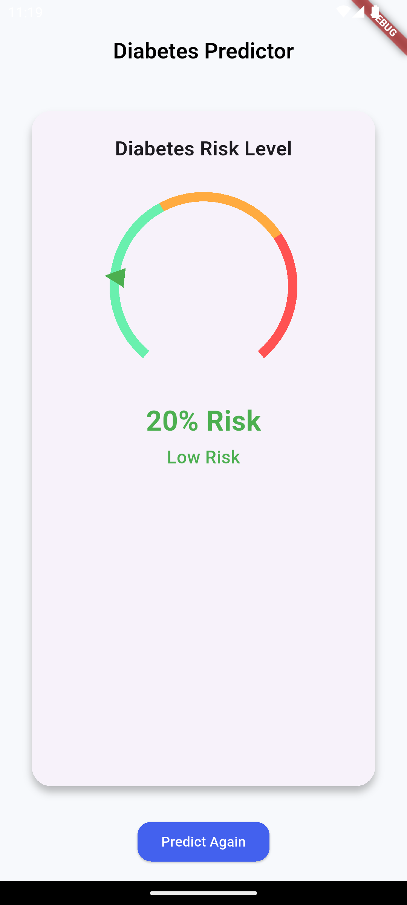
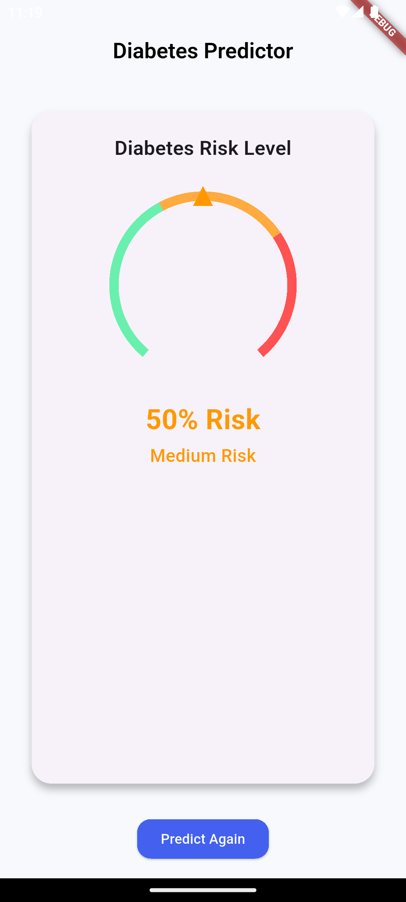

# Diabetes Risk Predictor (Flutter App)

A simple **Diabetes Risk Predictor** mobile app built with **Flutter** that uses rule-based logic to estimate a user’s diabetes risk level. This app is designed for **educational and testing purposes only**—it is **not a medical diagnosis tool**. Always consult a healthcare professional for real health concerns.

---

## Features

* Predicts **diabetes risk** based on user input:

  * Age
  * Glucose
  * BMI (Body Mass Index)
  * Diabetes Pedigree Function (DPF)
* **Interactive Gauge** showing risk level visually:

  * Low Risk (Green)
  * Medium Risk (Orange)
  * High Risk (Red)
* Percentage and label below the Gauge update dynamically with the result.
* Supports **Light & Dark Mode** based on the user’s device theme.
* Input validation ensures only valid numbers are accepted.
* Clean, modern UI with Material 3 design.

---


## Screenshots

*Optional: add screenshots here if needed*




---

## Installation

1. Clone the repository:

```bash
git clone https://github.com/yourusername/diabetes-risk-predictor.git
```

2. Navigate to the project folder:

```bash
cd diabetes-risk-predictor
```

3. Install dependencies:

```bash
flutter pub get
```

4. Run the app on your device or emulator:

```bash
flutter run
```

---

## Usage

1. Enter your Age, Glucose, BMI, and Diabetes Pedigree Function.
2. Tap **"Predict Diabetes Risk"**.
3. See your **risk level** on the Gauge along with percentage and label.
4. Tap **Predict** again to reset the input fields.

---

## Example Test Values

| Risk Level | Age | Glucose | BMI | DPF |
| ---------- | --- | ------- | --- | --- |
| Low        | 25  | 90      | 22  | 0.2 |
| High       | 50  | 160     | 45  | 0.6 |

---

## Disclaimer

⚠️ **This app is for educational purposes only**.
The results are **rule-based predictions**, not medical advice.
Always consult a **healthcare professional** for real health assessments.

---

## Dependencies

* [Flutter](https://flutter.dev/)
* [syncfusion_flutter_gauges](https://pub.dev/packages/syncfusion_flutter_gauges) for Gauge visualization

---

## License

MIT License © Your Name
